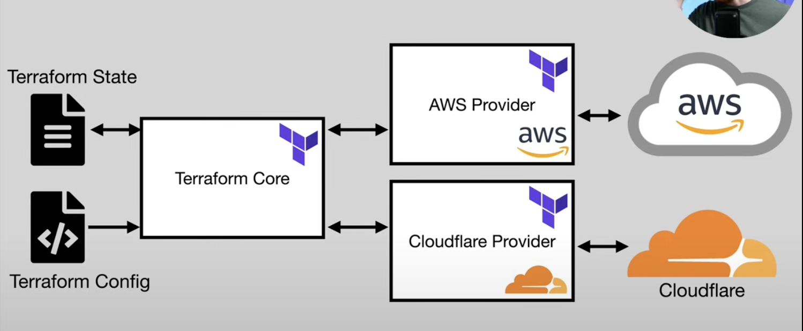

- [1. Terraform Notes](#1-terraform-notes)
  - [1.1. What is Infrastructure as Code (IaC)](#11-what-is-infrastructure-as-code-iac)
  - [1.2. Terraform Overview and Setup](#12-terraform-overview-and-setup)
    - [1.2.1. Overview of Terraform Architecture](#121-overview-of-terraform-architecture)
    - [1.2.2. Setup](#122-setup)
  - [1.3. State File](#13-state-file)
  - [1.4. Variables and Outputs](#14-variables-and-outputs)
    - [1.4.1. Variable types](#141-variable-types)
    - [1.4.2. Setting Input Variables](#142-setting-input-variables)
    - [1.4.3. Types \& Validation](#143-types--validation)
    - [1.4.4. Sensitive Data](#144-sensitive-data)
  - [1.5. Additional Language Features](#15-additional-language-features)
    - [1.5.1. Expressions + Functions](#151-expressions--functions)
    - [1.5.2. Meta Arguments](#152-meta-arguments)
    - [1.5.3. Provisioners](#153-provisioners)
  - [1.6. Project Organization \& Modules](#16-project-organization--modules)
    - [1.6.1. Module](#161-module)
  - [1.7. Managing Multiple Environments](#17-managing-multiple-environments)
  - [1.8. Testing Terraform Code](#18-testing-terraform-code)
  - [1.9. Developer Workflows](#19-developer-workflows)
  - [1.10. Potiential Gotchas](#110-potiential-gotchas)


# 1. Terraform Notes

## 1.1. What is Infrastructure as Code (IaC)

* Categories of IaC tools:
  * Ad hoc scripts
  * Configuration management tools
  * Server Templating tools
  * Orchestration tools
  * Provisioning tools
* Declarative vs Imperative:
  * **Declarative tools** - Define the end state of what you want (mention how much you want beforehand). The tool decides how to reach that end state with what API calls.
  * **Imperative tools** - You tell the system what you want to happen and sequence in which to happen. 
* Terraform is more declarative.
* IaC Provisioning Tools Landscape - 
  * **Cloud Specific** - Cloud Formation, Azure Resource Manager, GC Deployment Manager
  * **Cloud Agnostic** - Terraform, Pulumi

## 1.2. Terraform Overview and Setup

* Terraform is a tool for building, changing and versioning infrastructure safely and efficiently.
* Enables application software best practices to infrastructure.
* Compatible with many clouds and services.
* TF is a provisioning focused tool, you can combine it with other tools like config management tools. Eg: Ansible (to install needed dependencies)
  
### 1.2.1. Overview of Terraform Architecture


### 1.2.2. Setup 

* ```brew install terraform```
* Create a tf file (suppose you configure an aws instance)
* ```terraform init``` (initialize the backend)
* ```terraform plan``` (Goes to aws to see the current state and compares with the resources specified in the tf file)
* ```terraform apply``` (initalize the resources)
* `terraform destroy` (destroy resources)

## 1.3. State File

* Terraform's representation of the world
* JSON file containing info about every resource and data object.
* Contains senstive info. Always encrypt it.
* Can be stored locally or remotely. (Remotely in S3 or GCS or Terraform Cloud)

## 1.4. Variables and Outputs

### 1.4.1. Variable types

* Input variables
  * var.{name}
  * Example:
  ```
  variable "instance type" {
    descriptiom = "ec2 instance type"
    type = string
    default = "t2.micro"
  }
  ```

* Local Variables
  * local.{name}
  * Example:
  ```
  locals {
    service_name = "My Service"
  }
  ```

* Output Variables
  * Example-
  ```
  output "instance_ip_Addr" {
    value = aws_instance.instance.public_ip
  }
  ```

### 1.4.2. Setting Input Variables

(Order of precendence: lowest -> highest)
* Manual entry during plan/apply
* Default value in declaration block
* TF_VAR_{name} env variables
* terraform.tfvars file
* `*.auto.tfvars` file
* Command line -var or -var-file

### 1.4.3. Types & Validation

* Primitive-
  * string
  * number 
  * bool
* Complex:
  * list
  * set
  * map
  * object
  * tuple
* Validation-
  * type checking happens automatically
  * custom conditions can be enforced

### 1.4.4. Sensitive Data

* Mark variables as sensitive with `sensitive = true`
* Pass to tf apply with `TV_VAR_variable` / `-var` command
* Can also use external secret store like AWS Secrets Manager

## 1.5. Additional Language Features

### 1.5.1. Expressions + Functions

* Expressions
  * Template Strings
  * Operators (!, -, *, /, %, >, ==, etc)
  * Conditionals (cond ? true: false)
  * For ([for o in var.list: o.id])
  * Splat (var.list[*].id)
  * Dynamic Blocks
  * Constraints (Type & Version)
* Functions
  * Numberic
  * String
  * Collection
  * Encoding
  * Filesystem
  * Date&Time
  * Hash & Crypto etc

### 1.5.2. Meta Arguments

* depends_on
  * Tf automatically generates dependency graph based on references
  * If 2 resources depend on each other (but not each others data), depends on specifies that dependency to enforce ordering
* Count
  * Allows for creation of multiple resources/modules from a single block
* for_each
  * Allows for creation of multiple resources/modules from a single block
  * Allows more control to customize each resource than count
* Lifecycle
  * Set of meta arguments to control tf behaviour for specific resources
  * create_before_destroy (bool)
  * ignore_changes  (list)
  * prevent_destroy (bool)

### 1.5.3. Provisioners

* Perform action on local / remote machine
* Tf with other tools can act as provisioner

## 1.6. Project Organization & Modules

### 1.6.1. Module

* Container for taking multiple resources used together and bundling them in a reusable fashion.
* Collection of `.tf` and `.tf.json` files in a single directory
* Types of Modules:
  * Root Module - Default module containing all .tf files in the main working dir.
  * Child Module - A seperate external module referred to from a .tf file
* Module sources:
  * Local paths
  * TF registry
  * Github
  * HTTP URLs
* Example:
```
module "example" {
    source = "{source}"

    # define all the input values here that the module consumes
}
```

## 1.7. Managing Multiple Environments

* Two approaches-
  * **Workspaces** - Multiple named sections within a single backend
  * **File Structure** - Directory layout provides seperation, modules provide reuse
* Workspaces-
  * **Pros** - 
    * Easy to get started
    * Convenient terraform.workspace
    * Minimize code duplication
  * **Cons**-
    * Prone to human error
    * State stored within same backend
    * Codebase doesnt unambiguously show deployment configurations
* File Structure-
  * **Pros**-
    * Isolation of backends (better security and less human error)
    * Codebase fully represents deployed state
  * **Cons**-
    * Multiple tf apply required to provision environments
    * More code duplication (can be minimized with modules)
* **Terragrunt** - A tool that provides utilities to make certain tf use cases easier.
* Commands-
  * `terraform workspace list`
  * `terraform workspace new production`

## 1.8. Testing Terraform Code

* Static checks-
  * Built in-
    * tf fmt
    * tf validate
    * tf plan
    * custom validation rules
  * External-
    * tflint
    * checkov, tfsec, terrascan, terraform-compliance, snyk
    * Terraform Sentinel (enterprise only)
* Manual Testing - tf init, plan, apply, destroy
* Automated Testing - Terratest

## 1.9. Developer Workflows

* Usually, its good practice to have seperate accounts for dev / staging / prod env.
  * It isolates env to protect minimize blast radius
  * Reduce naming conflicts for resources
  * Con: Add complexity to tf config (but can be done with tooling)

## 1.10. Potiential Gotchas

* Name changes when refactoring - changing name for you might mean just changing the name of a resource but for tf it means deleting a resource and spinning up a new one.
* Sensitive data in tf state files
* Cloud timeouts
* Naming conflicts
* Forgetting to destroy test-infra
* Uni-directional version upgrades

